Video Link: [https://youtu.be/wBtPGnVnA9g]()

# Data Structures & Algorithms In JavaScript

## What is Data Structure and Algorithm?

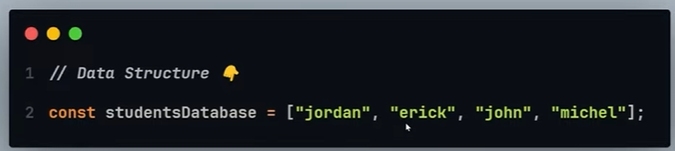

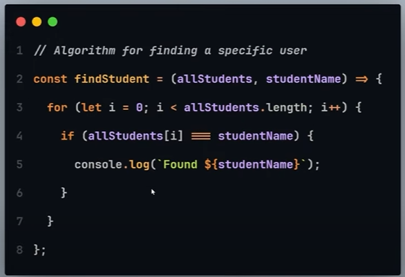

## What is bigO notation?

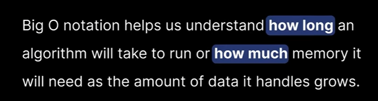

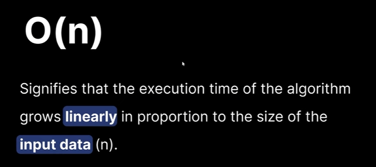

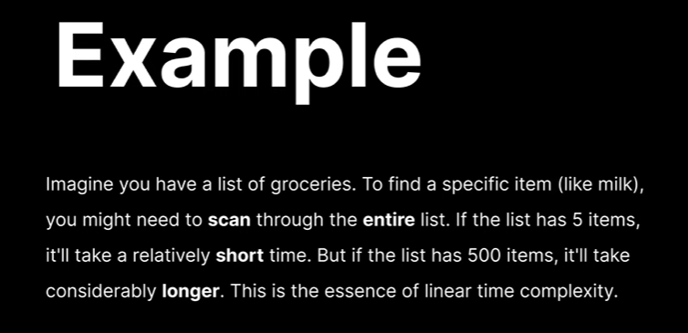

```
const groceries = ["milk", "bread", "eggs", "flour", "cheese", "sugar"];

const searchForItem = (item) => {
  let n = groceries.length;

  // O(n)
  for (let i = 0; i < n; i++) {
    if (groceries[i] === item) {
      console.log(`Found: ${item}`);
    }
  }

  // O(n)
  for (let j = 0; j < n; j++) {
    if (groceries[j] === item) {
      console.log(`Found: ${item} 2`);
    }
  }
};

// n + n = 2n -> O(2n)
// Drop the constant so it becomes O(2n)
```

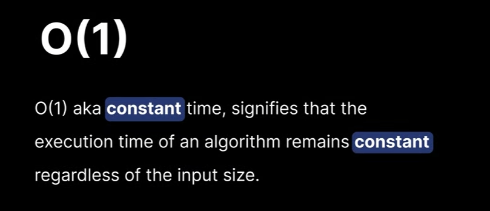

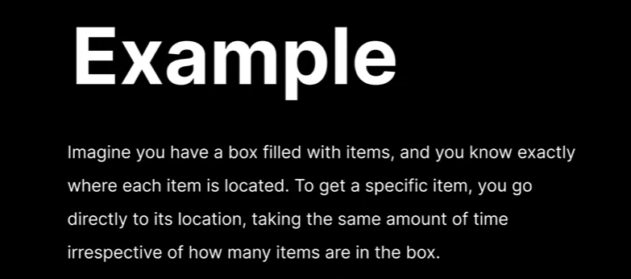

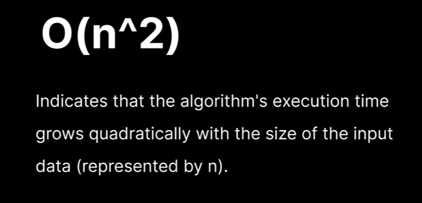

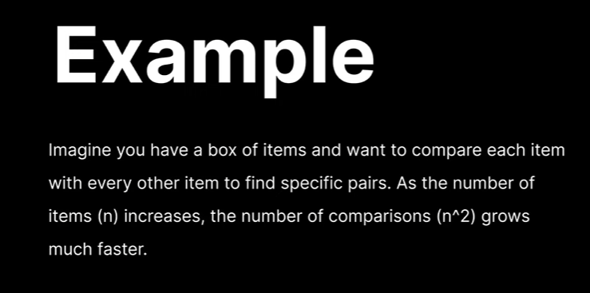

```
function findPairs(arr) {
  // O(n^2) -> Nested for-loop
  
  for (let i = 0; i < arr.length; i++) {
    for (let j = i + 1; j < arr.length; j++) {
      console.log(`Pair: ${arr[i]}, ${arr[j]}`);
    }
  }
}
```

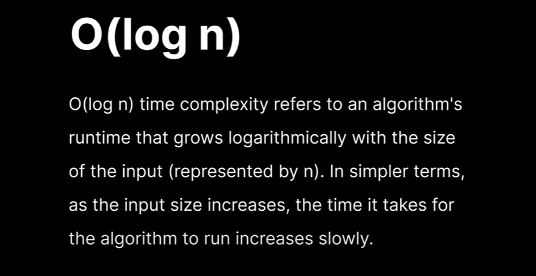

## Arrays

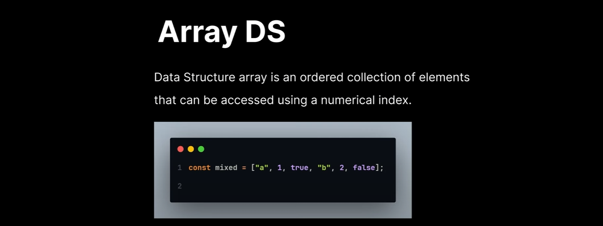

### Array Methods

1. push()
2. get()
3. pop()
4. shift()
5. unshift()

## Reverse String

```
const str = "Hello";
let newStr = "";

for (let i = str.length - 1; i >= 0; i--) {
  newStr += str[i];
}

console.log(newStr);

```

## Palindromes

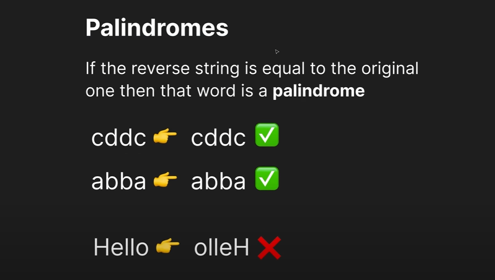

```
function isPalindrome(str) {
  let reverseStr = str.split("").reverse().join("");
  if (reverseStr === str) {
    return true;
  } else {
    return false;
  }
}

console.log(isPalindrome("cddc"));
console.log(isPalindrome("Hello"));
```

## Reverse Integer

```
function reverseInteger(int) {
  let reversed = int.toString().split("").reverse().join("");
  let num = Number(reversed);
  return num;
}

console.log(reverseInteger(1234));
```

## Sentence Capitalization

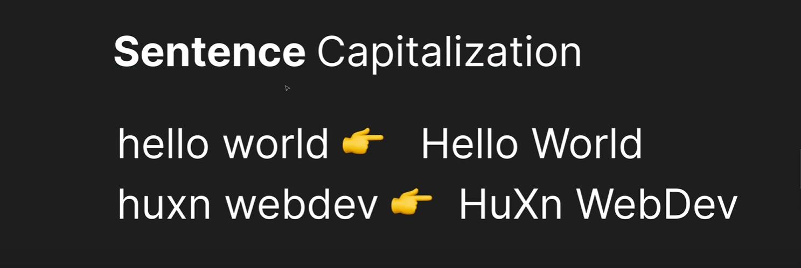

```
function sentenceCapitalization(str) {
  return str
    .toLowerCase()
    .split(" ")
    .map((word) => word[0].toUpperCase() + word.slice(1))
    .join(" ");
}

console.log(sentenceCapitalization("hello world")); // Hello World
console.log(sentenceCapitalization("milind sahu")); // Milind Sahu
```

## FizzBuzz

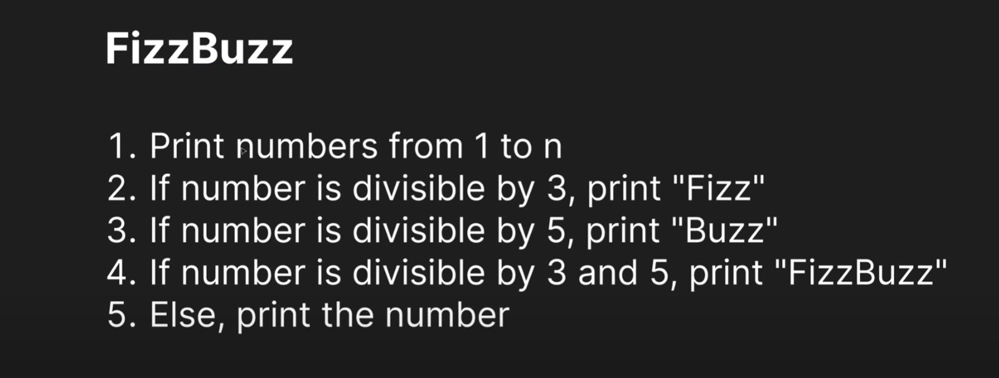

```
function fizzBuzz(num) {
  for (let i = 1; i <= num; i++) {
    if (i % 3 === 0 && i % 5 === 0) {
      console.log("FizzBuzz");
    } else if (i % 3 === 0) {
      console.log("Fizz");
    } else if (i % 5 === 0) {
      console.log("Buzz");
    } else {
      console.log(i);
    }
  }
}
```

## Max Profit

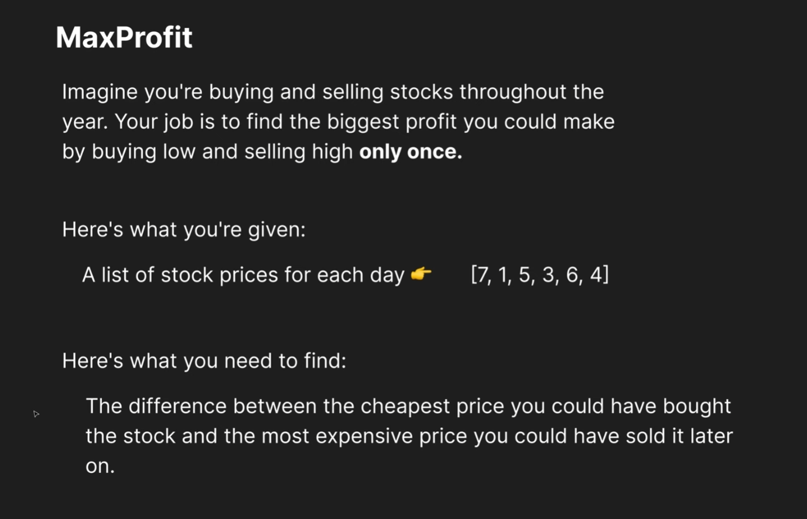

```
function maxProfit(prices) {
  let minPrice = prices[0];
  let maxProfit = 0;

  for (let i = 1; i < prices.length; i++) {
    const currentPrice = prices[i];
    minPrice = Math.min(minPrice, currentPrice);
    const highestProfit = currentPrice - minPrice;
    maxProfit = Math.max(maxProfit, highestProfit);
  }
  return maxProfit;
}

console.log(maxProfit([7, 1, 5, 3, 6, 4]));
```

## Array Chunk

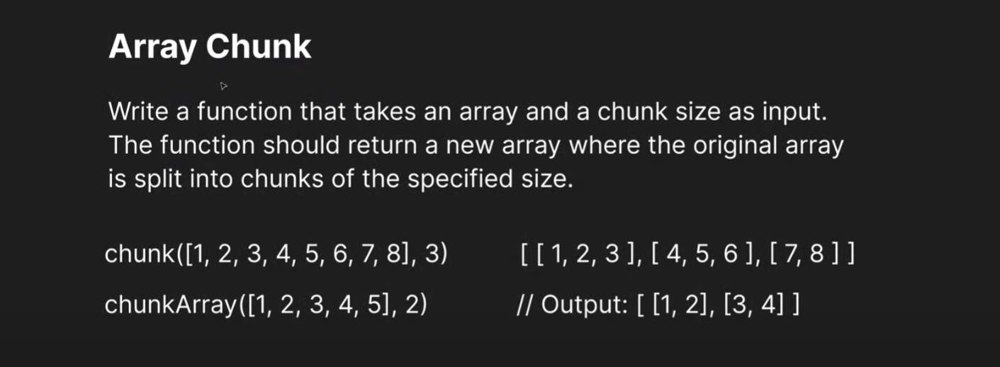

### Steps To Solve:

1. Create an empty array to hold the chunks
2. Set a starting index to keep track of where we are in the original array
3. Loop through the original array as long as the index hasn't reached the end
4. Extract a chunk of the desired size from the original array
5. Add the extracted chunk to the `chunked' array
6. Move the index forward by the chunk size to get to the next chunk
7. Return the final array of chunks

### Concept: Array Method Slice() & Splice()

slice()

* Changes are done on the **new array**.

splice()

* Changes are done on the **same array**.

```
const chunk = (array, size) => {
  const chunked = [];
  let index = 0;

  while (index < array.length) {
    const chunk = array.slice(index, index + size);
    chunked.push(chunk);
    index += size;
  }
  return chunked;
};

console.log(chunk([1, 2, 3, 4, 5, 6, 7, 8], 3));
```

## Two Sum

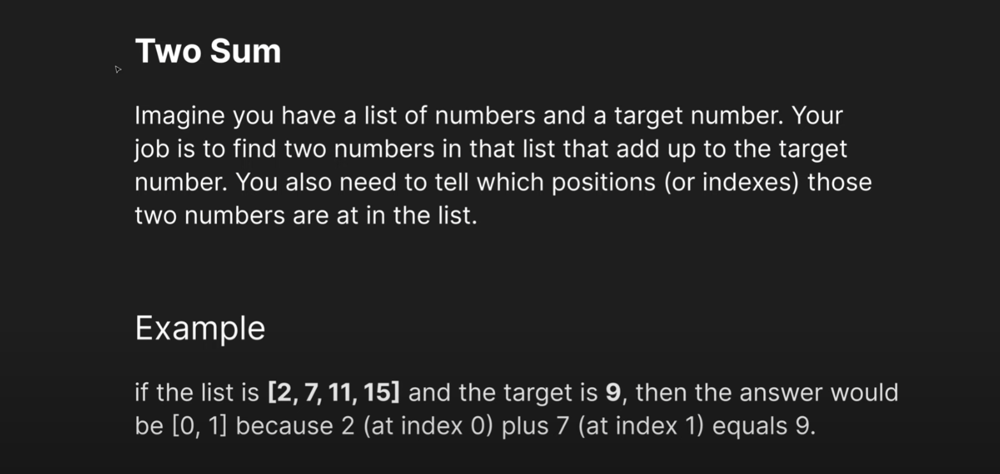
