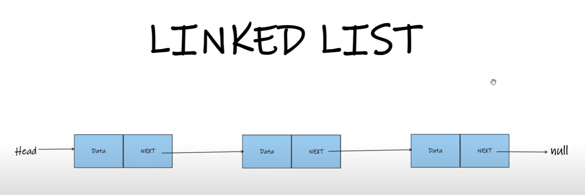

# Linked List

## What is Linked List?

* Linked is similar to array, but in array the size is fixed, in linked list size can be increased or descreased.
* Not in contigous memory location
* Starting point of the linked list is called **Head**.
* Ending point of the linked list is called **Tail**.
* Example browser tabs.
* We can only move from left to right.
* We cannot move from right to left.

